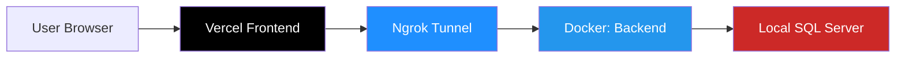

# 🐳 VETFEED Backend - Docker + Ngrok Setup

Hướng dẫn chạy Backend API bằng Docker với Ngrok tunnel để expose ra Internet.

---

## 🌐 Live Deployment

| Service              | URL                                                                                  | Description                 |
| -------------------- | ------------------------------------------------------------------------------------ | --------------------------- |
| **Frontend**         | [https://vetfeed-management-fe.vercel.app](https://vetfeed-management-fe.vercel.app) | Deployed on Vercel          |
| **Backend (Local)**  | http://localhost:5186                                                                | Local access                |
| **Backend (Public)** | Check http://localhost:4040                                                          | Ngrok tunnel URL            |
| **Ngrok Dashboard**  | http://localhost:4040                                                                | View requests & tunnel info |

---

## 📋 Yêu cầu

- ✅ Docker Desktop (hoặc Docker Engine + Docker Compose)
- ✅ SQL Server đang chạy trên máy local (port 1433)
- ✅ Database `VETFEED_MANAGEMENT` đã được tạo
- ✅ Ngrok account (free tier OK) - [Sign up here](https://dashboard.ngrok.com/signup)

---

## 🚀 Quick Start

### 1️⃣ Cấu hình docker-compose.yml

File `docker-compose.yml` đã được tạo sẵn với 2 services:

- `backend`: .NET API server
- `ngrok`: Tunnel để expose Backend ra Internet

**Cập nhật các giá trị sau:**

```yaml
# Line 12: SQL Server password
- ConnectionStrings__DefaultConnection=Server=host.docker.internal;Database=VETFEED_MANAGEMENT;User Id=sa;Password=YOUR_SQL_PASSWORD;TrustServerCertificate=True;

# Line 30: Ngrok authtoken
- NGROK_AUTHTOKEN=YOUR_NGROK_TOKEN_HERE
```

**Lấy Ngrok Token:**

1. Đăng nhập: https://dashboard.ngrok.com/
2. Vào: https://dashboard.ngrok.com/get-started/your-authtoken
3. Copy token và paste vào `docker-compose.yml`

---

### 2️⃣ Khởi động containers

```bash
# Từ thư mục VETFEED.Backend
docker-compose up -d --build
```

**Kết quả:**

```
✔ Container vetfeed-backend  Started
✔ Container vetfeed-ngrok    Started
```

---

### 3️⃣ Lấy Ngrok Public URL

**Option A: Qua Web Dashboard**

```bash
# Mở browser
start http://localhost:4040
```

**Option B: Qua API**

```powershell
Invoke-RestMethod -Uri "http://localhost:4040/api/tunnels" |
  Select-Object -ExpandProperty tunnels |
  Select-Object -ExpandProperty public_url
```

**Kết quả:** `https://abc123.ngrok-free.dev`

---

### 4️⃣ Cập nhật Frontend (Vercel)

1. Vào Vercel Dashboard → Project Settings → Environment Variables
2. Cập nhật `NEXT_PUBLIC_API_URL` = `https://abc123.ngrok-free.dev`
3. Redeploy Frontend

**Hoặc** trong code Frontend:

```javascript
const apiClient = axios.create({
  baseURL: "https://abc123.ngrok-free.dev",
  headers: {
    "Content-Type": "application/json",
    "ngrok-skip-browser-warning": "true", // Bắt buộc!
  },
});
```

---

## 📊 Kiểm tra trạng thái

### Xem containers đang chạy

```bash
docker ps
```

### Xem logs Backend

```bash
docker logs vetfeed-backend -f
```

### Xem logs Ngrok

```bash
docker logs vetfeed-ngrok -f
```

### Test API qua Ngrok

```powershell
# Thay YOUR_NGROK_URL bằng URL thực tế
Invoke-RestMethod -Uri "https://YOUR_NGROK_URL/api/sanphams" `
  -Headers @{"ngrok-skip-browser-warning"="true"}
```

---

## 🔄 Quản lý containers

### Dừng containers

```bash
docker-compose stop
```

### Khởi động lại

```bash
docker-compose start
```

### Dừng và xóa

```bash
docker-compose down
```

### Rebuild sau khi sửa code

```bash
docker-compose up -d --build
```

---

## 🆘 Troubleshooting

### ❌ Backend không kết nối database

**Lỗi:** "❌ Không thể kết nối database"

**Giải pháp:**

1. Kiểm tra SQL Server đang chạy: `sqlcmd -S localhost -U sa -P YourPassword`
2. Kiểm tra database tồn tại: `SELECT name FROM sys.databases`
3. Kiểm tra password trong `docker-compose.yml`
4. Kiểm tra SQL Server cho phép TCP/IP (SQL Server Configuration Manager)
5. Kiểm tra firewall không block port 1433

---

### ❌ Ngrok không khởi động

**Lỗi:** Container `vetfeed-ngrok` exit ngay

**Giải pháp:**

```bash
# Xem logs
docker logs vetfeed-ngrok

# Thường do authtoken sai
# Kiểm tra lại token tại: https://dashboard.ngrok.com/get-started/your-authtoken
```

---

### ❌ Frontend không gọi được Backend

**Lỗi:** CORS error hoặc Network Error

**Checklist:**

- [ ] Ngrok URL đã được thêm vào CORS trong `Program.cs`
- [ ] Frontend đã cập nhật `NEXT_PUBLIC_API_URL`
- [ ] Frontend đã thêm header `ngrok-skip-browser-warning: "true"`
- [ ] Ngrok container đang chạy (`docker ps`)
- [ ] Ngrok URL còn valid (check http://localhost:4040)

**Test CORS:**

```bash
# Kiểm tra Backend có cho phép Vercel domain không
curl -I https://YOUR_NGROK_URL/api/sanphams \
  -H "Origin: https://vetfeed-management-fe.vercel.app"
```

---

### 🔄 Ngrok URL thay đổi

**Vấn đề:** Mỗi lần restart, ngrok tạo URL mới

**Giải pháp tạm thời:**

1. Lấy URL mới từ http://localhost:4040
2. Cập nhật Frontend environment variable
3. Redeploy Frontend

**Giải pháp lâu dài:**

- Nâng cấp Ngrok paid plan để có static domain
- Hoặc deploy Backend lên cloud (Railway, Render, Azure)

---

## 📝 Architecture



---

## 💡 Best Practices

### ✅ DO

- Giữ ngrok và backend containers chạy liên tục khi develop
- Check ngrok dashboard (localhost:4040) để debug requests
- Test API local trước khi test qua ngrok
- Commit `docker-compose.example.yml`, KHÔNG commit `docker-compose.yml`

### ❌ DON'T

- Hardcode ngrok URL vào code (dùng environment variables)
- Share ngrok URL publicly (có thể bị abuse)
- Dùng ngrok cho production (chỉ development/testing)
- Commit sensitive data (passwords, tokens) vào Git

---

## 🔐 Security Notes

- ⚠️ Ngrok URL là public, ai có URL đều truy cập được
- ⚠️ Không expose production database qua ngrok
- ⚠️ Sử dụng JWT authentication để bảo vệ API
- ⚠️ Thêm rate limiting nếu cần
- ⚠️ Monitor ngrok dashboard để phát hiện truy cập bất thường

---

## 📚 Additional Resources

- [Ngrok Documentation](https://ngrok.com/docs)
- [Docker Compose Documentation](https://docs.docker.com/compose/)
- [ASP.NET Core Docker](https://docs.microsoft.com/en-us/aspnet/core/host-and-deploy/docker/)
- [Vercel Environment Variables](https://vercel.com/docs/concepts/projects/environment-variables)

---

## 🎯 Quick Commands Reference

```bash
# Start everything
docker-compose up -d --build

# View ngrok URL
start http://localhost:4040

# View backend logs
docker logs vetfeed-backend -f

# Stop everything
docker-compose down

# Restart ngrok only
docker-compose restart ngrok
```
