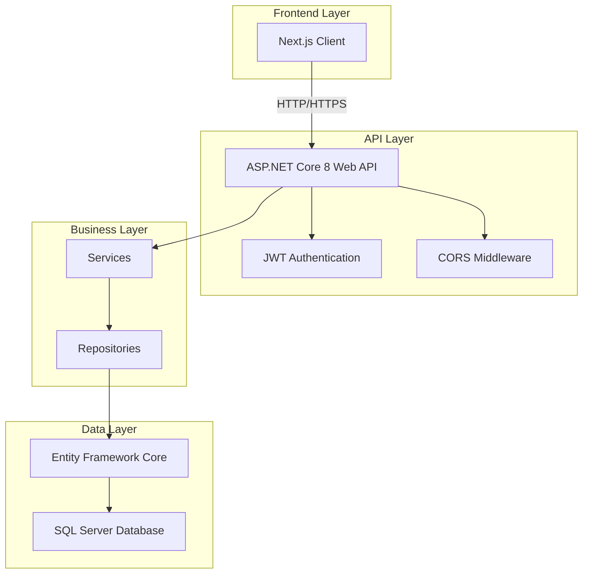
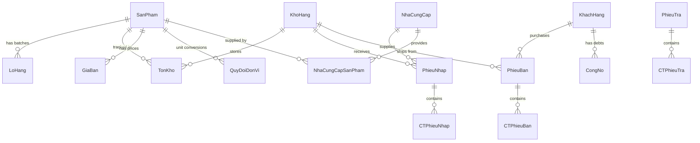

# 🐾 VETFEED Backend

<div align="center">

**A modern, enterprise-grade backend system for veterinary feed and medicine store management**

[](https://dotnet.microsoft.com/)
[](LICENSE)
[](CONTRIBUTING.md)

[Features](#-key-features) • [Architecture](#-overall-architecture) • [Installation](#-installation) • [Documentation](#-folder-structure) • [Contributing](#-contribution-guidelines)

</div>

---

## 📖 Introduction

**VETFEED Backend** is a comprehensive RESTful API system designed to streamline operations for veterinary feed and medicine distribution stores. Built with modern .NET technologies, it provides robust solutions for inventory management, supplier relationships, customer debt tracking, and business analytics.

This project serves as both a production-ready backend system and an educational resource for learning enterprise-level backend development with ASP.NET Core.

### 🎯 Project Goals

- **Production-Ready**: Enterprise-grade architecture suitable for real-world deployment
- **Educational**: Demonstrates best practices in REST API design and .NET development
- **Scalable**: Foundation for future microservices and cloud deployment
- **Maintainable**: Clean code architecture with comprehensive documentation

### 👨‍🎓 Academic Information

- **Student**: Nguyễn Thành Trung
- **Student ID**: 23521683
- **University**: Trường Đại học Công nghệ Thông tin (University of Information Technology - UIT)
- **Institution**: Đại học Quốc gia TP. Hồ Chí Minh (Vietnam National University - Ho Chi Minh City)
- **Major**: Kỹ thuật Phần mềm (Software Engineering)
- **Email**: nguyentrung191225@gmail.com
- **GitHub**: [@NguyenThanhTrung-N2T](https://github.com/NguyenThanhTrung-N2T)
- **Purpose**: Backend development practice, internship preparation, and portfolio building

---

## ✨ Key Features

### 🏪 Core Business Operations

- **Product Management**
  - Comprehensive catalog for animal feed and veterinary medicines
  - Multi-unit conversion system (e.g., box → pack → piece)
  - Batch tracking with expiration date monitoring
  - Dynamic pricing management

- **Inventory Control**
  - Multi-warehouse support with real-time stock tracking
  - Automated stock level calculations
  - Warehouse transfer management
  - Low stock alerts and expiration warnings

- **Supplier Management**
  - Supplier directory with contact information
  - Product-supplier relationship tracking
  - Purchase order processing
  - Supplier performance analytics

- **Customer & Sales**
  - Customer database with transaction history
  - Sales invoice generation
  - Return/refund processing
  - Credit sales support

- **Financial Management**
  - Comprehensive debt tracking (accounts receivable)
  - Payment processing and reconciliation
  - Automated debt calculations
  - Financial reporting and analytics

### 🔐 Security & Authentication

- **JWT-based Authentication**: Secure token-based authentication system
- **Role-based Authorization**: Granular access control for different user roles
- **Password Security**: BCrypt hashing for password protection
- **Cookie & Header Support**: Flexible authentication methods

### 📊 Reporting & Analytics

- **Dashboard Metrics**: Real-time business KPIs and statistics
- **Inventory Reports**: Stock levels, movements, and valuations
- **Financial Reports**: Revenue, profit margins, and debt analysis
- **Custom Date Ranges**: Flexible reporting periods

### 🛠️ Developer Experience

- **Swagger/OpenAPI**: Interactive API documentation and testing
- **Docker Support**: Containerized deployment ready
- **CORS Configuration**: Frontend integration support
- **Comprehensive DTOs**: Type-safe data transfer objects

---

## 🏗️ Overall Architecture

### Technology Stack



### System Architecture

The VETFEED Backend follows a **layered architecture** pattern with clear separation of concerns:

```
┌─────────────────────────────────────────┐
│         Controllers Layer               │  ← HTTP Endpoints
├─────────────────────────────────────────┤
│         Services Layer                  │  ← Business Logic
├─────────────────────────────────────────┤
│         Repositories Layer              │  ← Data Access
├─────────────────────────────────────────┤
│         Entity Framework Core           │  ← ORM
├─────────────────────────────────────────┤
│         SQL Server Database             │  ← Data Storage
└─────────────────────────────────────────┘
```

### Core Components

| Component             | Technology                | Purpose                    |
| --------------------- | ------------------------- | -------------------------- |
| **Web Framework**     | ASP.NET Core 8.0          | RESTful API foundation     |
| **ORM**               | Entity Framework Core 8.0 | Database abstraction layer |
| **Database**          | SQL Server                | Relational data storage    |
| **Authentication**    | JWT Bearer                | Secure token-based auth    |
| **Password Hashing**  | BCrypt.Net                | Secure password storage    |
| **API Documentation** | Swagger/OpenAPI           | Interactive API docs       |
| **Containerization**  | Docker                    | Deployment packaging       |

### Database Schema Overview



### API Endpoints Structure

The API is organized into logical resource groups:

| Endpoint Group     | Description            | Example Routes         |
| ------------------ | ---------------------- | ---------------------- |
| `/api/sanphams`    | Product management     | GET, POST, PUT, DELETE |
| `/api/khohang`     | Warehouse operations   | GET, POST, PUT, DELETE |
| `/api/tonkhos`     | Inventory tracking     | GET (with filters)     |
| `/api/phieunhaps`  | Purchase orders        | POST, GET, PUT         |
| `/api/phieubans`   | Sales invoices         | POST, GET, PUT         |
| `/api/phieutras`   | Return processing      | POST, GET              |
| `/api/congnos`     | Debt management        | GET, POST, PUT         |
| `/api/khachhangs`  | Customer management    | GET, POST, PUT, DELETE |
| `/api/nhacungcaps` | Supplier management    | GET, POST, PUT, DELETE |
| `/api/taikhoan`    | Authentication & users | POST /login, /register |
| `/api/dashboard`   | Business analytics     | GET /stats, /revenue   |
| `/api/baocao`      | Reports                | GET /tonkho, /loinhuan |

---

## 💻 Installation

### Prerequisites

Before you begin, ensure you have the following installed:

- [.NET 8 SDK](https://dotnet.microsoft.com/download/dotnet/8.0) (LTS version)
- [SQL Server](https://www.microsoft.com/sql-server/sql-server-downloads) (2019 or later)
- [Git](https://git-scm.com/downloads)
- (Optional) [Docker Desktop](https://www.docker.com/products/docker-desktop) for containerized deployment

### Quick Start

#### 1️⃣ Clone the Repository

```bash
git clone https://github.com/NguyenThanhTrung-N2T/VETFEED.Backend.git
cd VETFEED.Backend
```

#### 2️⃣ Database Setup

**Option A: Using provided SQL script**

```bash
# Import the database schema and sample data
sqlcmd -S localhost -U sa -P YourPassword -i VetFeedMangementSQL.sql
```

**Option B: Using Entity Framework Migrations**

```bash
cd VETFEED.Backend.API
dotnet ef database update
```

#### 3️⃣ Configure Application Settings

Create `appsettings.json` from the example template:

```bash
# Copy the example file
cp appsettings.example.json VETFEED.Backend.API/appsettings.json
```

Edit `VETFEED.Backend.API/appsettings.json` with your configuration (see [Environment Configuration](#-environment-configuration) section).

#### 4️⃣ Restore Dependencies

```bash
cd VETFEED.Backend.API
dotnet restore
```

#### 5️⃣ Run the Application

```bash
dotnet run
```

The API will be available at:

- **HTTP**: `http://localhost:5186`
- **Swagger UI**: `http://localhost:5186/swagger`

---

## 🚀 Running the Project

### Development Mode

```bash
cd VETFEED.Backend.API
dotnet run --environment Development
```

**Features enabled in development:**

- Swagger UI for API testing
- Detailed error messages
- Hot reload support

### Production Mode

```bash
dotnet run --environment Production
```

**Production optimizations:**

- HTTPS redirection enabled
- Swagger UI disabled
- Optimized logging

### Using Docker

For containerized deployment, see [DOCKER_README.md](DOCKER_README.md) for detailed instructions.

**Quick Docker start:**

```bash
# Build and run with docker-compose
docker-compose up -d --build

# View logs
docker logs vetfeed-backend -f

# Stop containers
docker-compose down
```

### Verifying the Installation

Once the application is running, verify the setup:

1. **Check database connection**: Look for `✅ Kết nối database thành công!` in the console
2. **Access Swagger UI**: Navigate to `http://localhost:5186/swagger`
3. **Test authentication**: Use the `/api/taikhoan/login` endpoint

---

## ⚙️ Environment Configuration

### Configuration File Structure

The application uses `appsettings.json` for configuration. Create this file from `appsettings.example.json`:

```json
{
  "Logging": {
    "LogLevel": {
      "Default": "Information",
      "Microsoft.AspNetCore": "Warning"
    }
  },
  "AllowedHosts": "*",
  "ConnectionStrings": {
    "DefaultConnection": "Server=localhost;Database=VetFeedManagement;User Id=sa;Password=YourPassword;TrustServerCertificate=True;"
  },
  "Jwt": {
    "Issuer": "VETFEED",
    "Audience": "VETFEED.Client",
    "Key": "YourSecretKeyMustBeAtLeast32CharactersLong!",
    "ExpireMinutes": 480
  },
  "Smtp": {
    "Host": "smtp.gmail.com",
    "Port": "587",
    "Username": "your-email@gmail.com",
    "Password": "your-app-password",
    "From": "your-email@gmail.com"
  }
}
```

### Configuration Parameters

#### Database Connection

| Parameter                | Description                     | Example                                        |
| ------------------------ | ------------------------------- | ---------------------------------------------- |
| `Server`                 | SQL Server host                 | `localhost` or `host.docker.internal` (Docker) |
| `Database`               | Database name                   | `VetFeedManagement`                            |
| `User Id`                | SQL Server username             | `sa`                                           |
| `Password`               | SQL Server password             | Your secure password                           |
| `TrustServerCertificate` | Accept self-signed certificates | `True` (development only)                      |

#### JWT Authentication

| Parameter       | Description             | Recommendation                                      |
| --------------- | ----------------------- | --------------------------------------------------- |
| `Issuer`        | Token issuer identifier | `VETFEED`                                           |
| `Audience`      | Token audience          | `VETFEED.Client`                                    |
| `Key`           | Secret signing key      | **Minimum 32 characters**, use strong random string |
| `ExpireMinutes` | Token validity duration | `480` (8 hours)                                     |

> [!CAUTION]
> **Security Warning**: Never commit `appsettings.json` with real credentials to version control. The file is already in `.gitignore`.

#### SMTP Configuration (Optional)

Required for email features like password reset:

| Parameter  | Description                                  |
| ---------- | -------------------------------------------- |
| `Host`     | SMTP server address                          |
| `Port`     | SMTP port (587 for TLS)                      |
| `Username` | Email account username                       |
| `Password` | App-specific password (not regular password) |
| `From`     | Sender email address                         |

### Environment-Specific Configuration

The application supports multiple environment configurations:

- `appsettings.json` - Base configuration
- `appsettings.Development.json` - Development overrides
- `appsettings.Production.json` - Production overrides (create if needed)

---

## 📁 Folder Structure

```
VETFEED.Backend/
├── 📄 README.md                          # This file
├── 📄 DOCKER_README.md                   # Docker deployment guide
├── 📄 LICENSE                            # Project license
├── 📄 .gitignore                         # Git ignore rules
├── 📄 .dockerignore                      # Docker ignore rules
├── 📄 Dockerfile                         # Docker image definition
├── 📄 docker-compose.example.yml         # Docker compose template
├── 📄 appsettings.example.json           # Configuration template
├── 📄 VetFeedMangementSQL.sql           # Database schema & seed data
├── 📄 VETFEED.Backend.slnx              # Solution file
│
└── 📁 VETFEED.Backend.API/              # Main API project
    ├── 📄 Program.cs                     # Application entry point & configuration
    ├── 📄 appsetting.json                # Runtime configuration (gitignored)
    ├── 📄 appsettings.Development.json   # Development settings
    ├── 📄 VETFEED.Backend.API.csproj     # Project file
    │
    ├── 📁 Controllers/                   # API endpoints (17 controllers)
    │   ├── TaiKhoansController.cs        # Authentication & user management
    │   ├── SanPhamsController.cs         # Product management
    │   ├── KhoHangsController.cs         # Warehouse management
    │   ├── TonKhosController.cs          # Inventory tracking
    │   ├── PhieuNhapsController.cs       # Purchase orders
    │   ├── PhieuBansController.cs        # Sales invoices
    │   ├── PhieuTrasController.cs        # Return processing
    │   ├── PhieuChuyenKhosController.cs  # Warehouse transfers
    │   ├── CongNosController.cs          # Debt management
    │   ├── KhachHangsController.cs       # Customer management
    │   ├── NhaCungCapsController.cs      # Supplier management
    │   ├── NhaCungCapSanPhamsController.cs # Supplier-product relations
    │   ├── LoHangsController.cs          # Batch management
    │   ├── GiaBansController.cs          # Price management
    │   ├── QuyDoiDonVisController.cs     # Unit conversions
    │   ├── DashBoardController.cs        # Business analytics
    │   └── BaoCaosController.cs          # Reporting endpoints
    │
    ├── 📁 Services/                      # Business logic layer (17 services)
    │   ├── JwtService.cs                 # JWT token generation & validation
    │   ├── EmailService.cs               # Email notifications
    │   ├── TaiKhoanService.cs            # User authentication logic
    │   ├── SanPhamService.cs             # Product business logic
    │   ├── KhoHangService.cs             # Warehouse operations
    │   ├── PhieuNhapService.cs           # Purchase processing
    │   ├── PhieuBanService.cs            # Sales processing
    │   ├── PhieuTraService.cs            # Return processing
    │   ├── CongNoService.cs              # Debt calculations
    │   ├── BaoCaoService.cs              # Report generation
    │   ├── DashBoardService.cs           # Analytics aggregation
    │   └── ... (other services)
    │
    ├── 📁 Repositories/                  # Data access layer (18 repositories)
    │   ├── TaiKhoanRepository.cs         # User data access
    │   ├── SanPhamRepository.cs          # Product data access
    │   ├── KhoHangRepository.cs          # Warehouse data access
    │   ├── TonKhoRepository.cs           # Inventory data access
    │   ├── PhieuNhapRepository.cs        # Purchase data access
    │   ├── PhieuBanRepository.cs         # Sales data access
    │   ├── CongNoRepository.cs           # Debt data access
    │   ├── BaoCaoRepository.cs           # Reporting queries
    │   ├── DashboardRepository.cs        # Analytics queries
    │   └── ... (other repositories)
    │
    ├── 📁 Models/                        # Entity models (19 entities)
    │   ├── TaiKhoan.cs                   # User account entity
    │   ├── SanPham.cs                    # Product entity
    │   ├── KhoHang.cs                    # Warehouse entity
    │   ├── TonKho.cs                     # Inventory entity
    │   ├── LoHang.cs                     # Batch entity
    │   ├── PhieuNhap.cs                  # Purchase order entity
    │   ├── CTPhieuNhap.cs                # Purchase order detail
    │   ├── PhieuBan.cs                   # Sales invoice entity
    │   ├── CTPhieuBan.cs                 # Sales invoice detail
    │   ├── PhieuTra.cs                   # Return entity
    │   ├── CTPhieuTra.cs                 # Return detail
    │   ├── PhieuChuyenKho.cs             # Transfer entity
    │   ├── CTPhieuChuyenKho.cs           # Transfer detail
    │   ├── CongNo.cs                     # Debt entity
    │   ├── KhachHang.cs                  # Customer entity
    │   ├── NhaCungCap.cs                 # Supplier entity
    │   ├── NhaCungCapSanPham.cs          # Supplier-product relation
    │   ├── GiaBan.cs                     # Price entity
    │   └── QuyDoiDonVi.cs                # Unit conversion entity
    │
    ├── 📁 DTOs/                          # Data Transfer Objects (90+ DTOs)
    │   ├── Auth/                         # Authentication DTOs
    │   ├── SanPham/                      # Product DTOs
    │   ├── KhoHang/                      # Warehouse DTOs
    │   ├── PhieuNhap/                    # Purchase DTOs
    │   ├── PhieuBan/                     # Sales DTOs
    │   ├── CongNo/                       # Debt DTOs
    │   ├── BaoCao/                       # Report DTOs
    │   └── ... (other DTO groups)
    │
    ├── 📁 Data/                          # Database context
    │   └── VetFeedManagementContext.cs   # EF Core DbContext
    │
    ├── 📁 Enums/                         # Enumeration types (16 enums)
    │   ├── TrangThaiPhieu.cs             # Invoice status
    │   ├── LoaiCongNo.cs                 # Debt type
    │   ├── PhuongThucThanhToan.cs        # Payment method
    │   ├── VaiTro.cs                     # User role
    │   └── ... (other enums)
    │
    ├── 📁 Utils/                         # Utility classes
    │   ├── PasswordHasher.cs             # Password hashing utilities
    │   └── ... (other utilities)
    │
    └── 📁 POSTMAN/                       # API testing collections
        └── VETFEED.postman_collection.json
```

### Key Directory Descriptions

| Directory        | Purpose                | Key Responsibilities                                       |
| ---------------- | ---------------------- | ---------------------------------------------------------- |
| **Controllers**  | HTTP endpoint handlers | Request validation, response formatting, HTTP status codes |
| **Services**     | Business logic         | Transaction management, business rules, orchestration      |
| **Repositories** | Data access            | Database queries, CRUD operations, data mapping            |
| **Models**       | Domain entities        | Database schema representation, entity relationships       |
| **DTOs**         | Data contracts         | API request/response shapes, validation rules              |
| **Data**         | EF Core context        | Database configuration, entity mappings, relationships     |
| **Enums**        | Type definitions       | Status codes, categories, fixed value sets                 |
| **Utils**        | Helper functions       | Shared utilities, common operations                        |

---

## 🤝 Contribution Guidelines

We welcome contributions from the community! Whether you're fixing bugs, adding features, or improving documentation, your help is appreciated.

### How to Contribute

#### 1. Fork & Clone

```bash
# Fork the repository on GitHub, then clone your fork
git clone https://github.com/NguyenThanhTrung-N2T/VETFEED.Backend.git
cd VETFEED.Backend
```

#### 2. Create a Feature Branch

```bash
# Create a branch for your feature or fix
git checkout -b feature/your-feature-name

# Or for bug fixes
git checkout -b fix/bug-description
```

#### 3. Make Your Changes

- Follow the existing code style and conventions
- Write clear, descriptive commit messages
- Add comments for complex logic
- Update documentation if needed

#### 4. Test Your Changes

```bash
# Ensure the application builds
dotnet build

# Run the application and test manually
dotnet run

# Test your endpoints using Swagger UI
```

#### 5. Commit & Push

```bash
# Stage your changes
git add .

# Commit with a descriptive message
git commit -m "feat: add customer search functionality"

# Push to your fork
git push origin feature/your-feature-name
```

#### 6. Submit a Pull Request

- Go to the original repository on GitHub
- Click "New Pull Request"
- Select your branch and describe your changes
- Wait for review and address any feedback

### Commit Message Convention

We follow the [Conventional Commits](https://www.conventionalcommits.org/) specification:

```
<type>(<scope>): <description>

[optional body]

[optional footer]
```

**Types:**

- `feat`: New feature
- `fix`: Bug fix
- `docs`: Documentation changes
- `style`: Code style changes (formatting, etc.)
- `refactor`: Code refactoring
- `test`: Adding or updating tests
- `chore`: Maintenance tasks

**Examples:**

```bash
feat(auth): add password reset functionality
fix(inventory): correct stock calculation for returns
docs(readme): update installation instructions
refactor(services): simplify debt calculation logic
```

### Code Style Guidelines

- **Naming Conventions**:
  - PascalCase for classes, methods, and properties
  - camelCase for local variables and parameters
  - Descriptive names that reflect purpose

- **Code Organization**:
  - Keep methods focused and single-purpose
  - Use dependency injection for services
  - Follow repository pattern for data access

- **Comments**:
  - Add XML documentation for public APIs
  - Comment complex business logic
  - Avoid obvious comments

### What to Contribute

#### 🐛 Bug Reports

Found a bug? Please open an issue with:

- Clear description of the problem
- Steps to reproduce
- Expected vs actual behavior
- Environment details (OS, .NET version, etc.)

#### 💡 Feature Requests

Have an idea? Open an issue describing:

- The problem you're trying to solve
- Your proposed solution
- Any alternative approaches considered

#### 📝 Documentation

Documentation improvements are always welcome:

- Fix typos or unclear explanations
- Add examples or tutorials
- Translate documentation
- Improve code comments

#### 🧪 Testing

Help improve code quality:

- Add unit tests
- Add integration tests
- Improve test coverage
- Report edge cases

### Areas for Contribution

Here are some areas where contributions would be especially valuable:

- [ ] Unit test coverage for services and repositories
- [ ] Integration tests for API endpoints
- [ ] Performance optimization for complex queries
- [ ] Additional reporting features
- [ ] Mobile app integration examples
- [ ] Deployment guides (Azure, AWS, etc.)
- [ ] Localization/internationalization
- [ ] API rate limiting
- [ ] Caching strategies

---

## 📄 License

This project is licensed under the **MIT License** - see the [LICENSE](LICENSE) file for details.

### MIT License Summary

```
Copyright (c) 2026 Nguyễn Thành Trung

Permission is hereby granted, free of charge, to any person obtaining a copy
of this software and associated documentation files (the "Software"), to deal
in the Software without restriction, including without limitation the rights
to use, copy, modify, merge, publish, distribute, sublicense, and/or sell
copies of the Software, and to permit persons to whom the Software is
furnished to do so, subject to the following conditions:

The above copyright notice and this permission notice shall be included in all
copies or substantial portions of the Software.

THE SOFTWARE IS PROVIDED "AS IS", WITHOUT WARRANTY OF ANY KIND, EXPRESS OR
IMPLIED, INCLUDING BUT NOT LIMITED TO THE WARRANTIES OF MERCHANTABILITY,
FITNESS FOR A PARTICULAR PURPOSE AND NONINFRINGEMENT.
```

**What this means:**

- ✅ Commercial use allowed
- ✅ Modification allowed
- ✅ Distribution allowed
- ✅ Private use allowed
- ⚠️ No warranty provided
- ⚠️ License and copyright notice must be included

---

## 🗺️ Roadmap

### Current Version: 1.0.0 (Stable)

The current version includes all core features for store management operations.

### Planned Features

#### 🎯 Short-term (Next 3 months)

- [ ] **Enhanced Analytics**
  - Advanced sales forecasting
  - Inventory optimization suggestions
  - Supplier performance metrics
  - Customer segmentation analysis

- [ ] **Notification System**
  - Email notifications for low stock
  - Expiration date alerts
  - Payment reminders
  - System event notifications

- [ ] **Advanced Search & Filtering**
  - Full-text search across products
  - Advanced filtering options
  - Saved search queries
  - Export search results

- [ ] **Audit Logging**
  - Track all data modifications
  - User activity logs
  - System event logging
  - Compliance reporting

#### 🚀 Mid-term (3-6 months)

- [ ] **Multi-tenant Support**
  - Support multiple stores in one instance
  - Tenant isolation
  - Shared resources management
  - Tenant-specific configurations

- [ ] **Mobile API Enhancements**
  - Optimized endpoints for mobile apps
  - Offline sync support
  - Push notification infrastructure
  - Mobile-specific DTOs

- [ ] **Advanced Reporting**
  - Customizable report templates
  - Scheduled report generation
  - PDF/Excel export
  - Visual charts and graphs

- [ ] **Integration APIs**
  - Third-party accounting software integration
  - E-commerce platform connectors
  - Payment gateway integration
  - Shipping provider APIs

#### 🌟 Long-term (6-12 months)

- [ ] **Microservices Architecture**
  - Split into domain-specific services
  - Event-driven communication
  - Service mesh implementation
  - Independent scaling

- [ ] **Cloud-Native Features**
  - Azure/AWS deployment guides
  - Kubernetes orchestration
  - Auto-scaling configurations
  - Cloud storage integration

- [ ] **AI/ML Capabilities**
  - Demand forecasting
  - Anomaly detection
  - Price optimization
  - Recommendation engine

- [ ] **Advanced Security**
  - Two-factor authentication (2FA)
  - OAuth2/OpenID Connect
  - API rate limiting
  - Advanced threat detection

### Community Requests

We're listening! If you have feature requests, please:

1. Check existing issues to avoid duplicates
2. Open a new issue with the `enhancement` label
3. Describe your use case and proposed solution
4. Participate in the discussion

---

## 📞 Support & Contact

### Getting Help

- **Documentation**: Start with this README and [DOCKER_README.md](DOCKER_README.md)
- **Issues**: [GitHub Issues](https://github.com/NguyenThanhTrung-N2T/VETFEED.Backend/issues)
- **Discussions**: [GitHub Discussions](https://github.com/NguyenThanhTrung-N2T/VETFEED.Backend/discussions)

### Reporting Issues

When reporting issues, please include:

- Clear description of the problem
- Steps to reproduce
- Expected vs actual behavior
- Environment details (OS, .NET version, SQL Server version)
- Relevant logs or error messages

### Contact Information

- **Developer**: Nguyễn Thành Trung
- **Student ID**: 23521683
- **University**: Trường Đại học Công nghệ Thông tin - ĐHQG TP.HCM (UIT - VNU-HCM)
- **Major**: Kỹ thuật Phần mềm (Software Engineering)
- **Email**: nguyentrung191225@gmail.com
- **GitHub**: [@NguyenThanhTrung-N2T](https://github.com/NguyenThanhTrung-N2T)

---

## 🙏 Acknowledgments

This project was built using excellent open-source technologies:

- [ASP.NET Core](https://dotnet.microsoft.com/apps/aspnet) - Microsoft's web framework
- [Entity Framework Core](https://docs.microsoft.com/ef/core/) - Modern ORM for .NET
- [Swashbuckle](https://github.com/domaindrivendev/Swashbuckle.AspNetCore) - Swagger tools for .NET
- [BCrypt.Net](https://github.com/BcryptNet/bcrypt.net) - Password hashing library

Special thanks to:

- University of Information Technology for educational support
- The .NET community for excellent documentation and resources
- All contributors who help improve this project

---

## 📚 Additional Resources

### Learning Resources

- [ASP.NET Core Documentation](https://docs.microsoft.com/aspnet/core/)
- [Entity Framework Core Documentation](https://docs.microsoft.com/ef/core/)
- [REST API Best Practices](https://restfulapi.net/)
- [JWT Authentication Guide](https://jwt.io/introduction)

### Related Projects

- **VETFEED Frontend**: [Link to frontend repository]
- **VETFEED Mobile**: [Link to mobile app repository]

### API Documentation

Once the application is running, access the interactive API documentation at:

- **Swagger UI**: `http://localhost:5186/swagger`
- **OpenAPI Spec**: `http://localhost:5186/swagger/v1/swagger.json`

---

<div align="center">

**Built with ❤️ by Nguyễn Thành Trung**

If you find this project helpful, please consider giving it a ⭐ on GitHub!

[⬆ Back to Top](#-vetfeed-backend)

</div>
